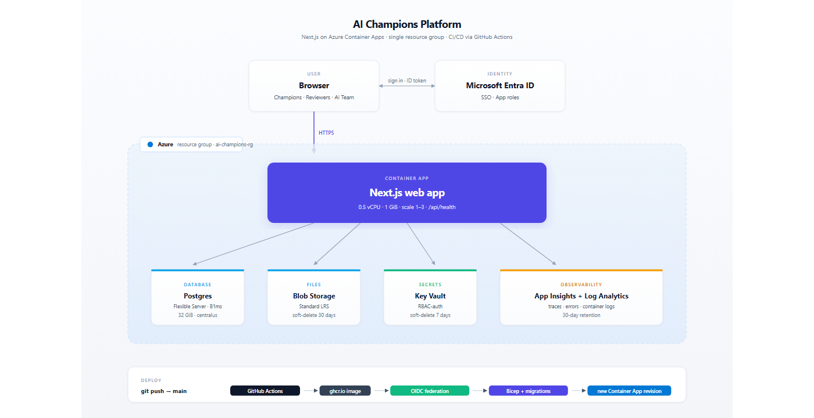

# AI Champions Platform — IT Proposal

Web app replacing the SharePoint + Excel + Power BI + manual-routing stack behind the AI Champions Program. **Live demo deployed.**

**Demo:** <https://aichamp-dev-app.orangeglacier-5bb9312f.eastus2.azurecontainerapps.io>
**Repo:** <https://github.com/DawsonSallee/ai-champions-platform>

{width=6.5in}

## Azure resources (one resource group, Microsoft-managed PaaS)

| Resource | Purpose | Spec |
| :--- | :--- | :--- |
| Container App | Web app (Next.js) | 0.5 vCPU · 1 GiB · scale 1–3 |
| PostgreSQL Flexible Server | Database | B1ms · 32 GiB · v16 |
| Blob Storage | Project artifacts | Standard LRS, private |
| Key Vault | Secrets | RBAC-auth |
| Log Analytics + App Insights | Telemetry | 30-day retention |
| Entra app registration | SSO + CI OIDC | AzureADMyOrg |

Infrastructure-as-code: `infra/main.bicep`. Recreatable from scratch in ~10 min.

## Cost (USD/month, pay-as-you-go)

| Posture | Monthly |
| :--- | ---: |
| Demo (always-on, current) | **$58** |
| Light production (scale-to-zero idle) | **$45** |
| Hardened production (HA + private endpoints + staging) | **$210** |

## Security

Entra SSO · OIDC federation for CI (no long-lived secrets) · TLS 1.2+ in transit · Microsoft-managed keys at rest · append-only audit log · soft-delete on data · Key Vault for secrets. Data classification cap: **Internal** (PII stored by reference only). Production posture switches to private endpoints + VPN-only ingress via one Bicep parameter.

## Asks from IT

1. **Assign a corporate Azure subscription** for production.
2. **Approve an Entra app registration** in the Enercon tenant (SSO + federated identity for CI).
3. **Approve `networkPosture=private`** for the production deployment.
4. **Assign an IT Security reviewer** to close out the platform's own IT Governance & Security Assessment (per existing framework).
5. **Provide the AI Champions M365 Group URL** for the Admin page link.

Once 1–3 are done, production is **one CI run** away.

## Caveats

- Demo runs on a personal Azure subscription. No real data goes in before #1 above.
- Container image lives on public `ghcr.io`. Can switch to a private Azure Container Registry (~$5/mo, 1-line change) if required.
- Background jobs (weekly nudge, SLA-breach checker) are coded but not yet scheduled.

---
*Dawson Sallee · AI Champions Program · May 2026*
